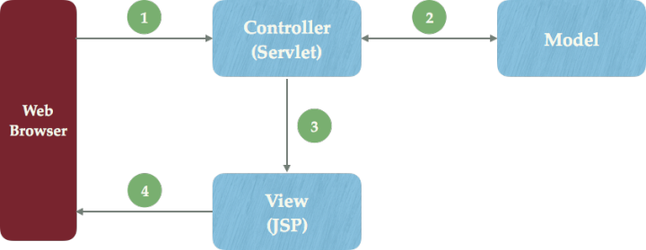

# Tomcat安装
前提：确保电脑安装好了jdk （亲测电脑安装的是javaSE的jdk 下载tomcat后仍然可以使用，就是说不需要安装javaEE的jdk也可以运行tomcat）
1 下载 http://tomcat.apache.org/  
分64位32位 可以用未安装版 解压即可
2 下载后解压  
进入到tomcat安装目录的bin目录下，双击startup.bat即可启动tomcat(还可以把startup.bat发送到桌面，以后启动就方便了)。

# jsp servlet MVC模式
https://zhuanlan.zhihu.com/p/20569158
JSP与Servlet比较  
我们已经学习了两种Java服务器端技术——JSP和Servlet，比较二者的不同：  

Servlet在Java代码中通过HttpServletResponse对象动态输出HTML内容  
JSP在静态HTML内容中嵌入Java代码，Java代码被动态执行后生成HTML内容  
两种技术有着不同的特点，在不同的场景下有着各自的优势：  

Servlet能够很好地组织业务逻辑代码，但是在Java源文件中通过字符串拼接的方式生成动态HTML内容会导致代码维护困难、可读性差  
JSP虽然规避了Servlet在生成HTML内容方面的劣势，但是在HTML中混入大量、复杂的业务逻辑同样也是不可取的  
各司其职——MVC模式  
既然JSP和Servlet都有自身的适用环境，那么能否扬长避短，让它们发挥各自的优势呢？答案是肯定的——MVC(Model-View-Controller)模式非常适合解决这一问题。  

MVC模式（Model-View-Controller）是软件工程中的一种软件架构模式，把软件系统分为三个基本部分：模型（Model）、视图（View）和控制器（Controller）：  

Controller——负责转发请求，对请求进行处理  
View——负责界面显示  
Model——业务功能编写（例如算法实现）、数据库设计以及数据存取操作实现  
在JSP/Servlet开发的软件系统中，这三个部分的描述如下所示：  
  

  
1 Web浏览器发送HTTP请求到服务端，被Controller(Servlet)获取并进行处理（例如参数解析、请求转发）  
2 Controller(Servlet)调用核心业务逻辑——Model部分，获得结果  
3 Controller(Servlet)将逻辑处理结果交给View（JSP），动态输出HTML内容  
4 动态生成的HTML内容返回到浏览器显示  
MVC模式在Web开发中的好处是非常明显，它规避了JSP与Servlet各自的短板，Servlet只负责业务逻辑而不会通过out.append()动态生成HTML代码；JSP中也不会充斥着大量的业务代码。这大大提高了代码的可读性和可维护性。  

# 一个简单的sevelet demo
1 电脑安装好jdk  
2 下载tomcat32位/64位安装包（无需安装）  
3 在任何位置新建一个项目文件夹 project1，在project1内新建三个文件夹 /classes /etc /src
新建 /src/Ch1Servlet.java(所有文件都需要设置字符集编码utf-8)
```
import javax.servlet.*;
import javax.servlet.http.*;
import java.io.*;

public class Ch1Servlet extends HttpServlet {
  public void doGet (HttpServletRequest reque, HttpServletResponse response) throws IOException {
    PrintWriter out = response.getWriter();
    java.util.Date today = new java.util.Date();
    out.println(
        "<html>" +
        "<body>" +
        "<h1>this is my first project</h1>" +
        "</body>" +
        "</html>"
      );
  }
}
```
新建 /etc/web.xml(所有文件都需要设置字符集编码utf-8)
```
<?xml version="1.0" encoding="UTF-8"?>
<!--
 Licensed to the Apache Software Foundation (ASF) under one or more
  contributor license agreements.  See the NOTICE file distributed with
  this work for additional information regarding copyright ownership.
  The ASF licenses this file to You under the Apache License, Version 2.0
  (the "License"); you may not use this file except in compliance with
  the License.  You may obtain a copy of the License at

      http://www.apache.org/licenses/LICENSE-2.0

  Unless required by applicable law or agreed to in writing, software
  distributed under the License is distributed on an "AS IS" BASIS,
  WITHOUT WARRANTIES OR CONDITIONS OF ANY KIND, either express or implied.
  See the License for the specific language governing permissions and
  limitations under the License.
-->

<web-app xmlns="http://java.sun.com/xml/ns/javaee"
  xmlns:xsi="http://www.w3.org/2001/XMLSchema-instance"
  xsi:schemaLocation="http://java.sun.com/xml/ns/javaee
                      http://java.sun.com/xml/ns/javaee/web-app_3_0.xsd"
  version="3.0"
  metadata-complete="true">

  <servlet>
    <servlet-name>Chapter1 Servlet</servlet-name>
    <servlet-class>Ch1Servlet</servlet-class>
  </servlet>
  <servlet-mapping>
    <servlet-name>Chapter1 Servlet</servlet-name>
    <url-pattern>/Serv1</url-pattern>
  </servlet-mapping>

</web-app>
```

4 javac编译文件 
在project1根目录，把servlet-api.jar拷贝到当前目录(servlet-api.jar文件原本存放在E:\apache-tomcat7\lib\)
```
javac -classpath ./servlet-api.jar -d classes ./src/Ch1Servlet.java
```
编译完成的文件保存在 /classes/Ch1Servlet.class

5 复制文件  
在tomcat内新建文件夹
E:\apache-tomcat7\webapps\ch1\WEB-INF  
把web.xml拷贝到当前目录，然后新建 WEB-INF\classes 把编译的文件Ch1Servlet.class拷贝到classes文件夹内

6 执行tomcat的startup.sh 
7 浏览器输入 http://localhost:8080/ch1/Serv1 页面出现 this is my first project  
8 关闭tomcat 执行bin/startup.sh  

# 解决tomcat控制台乱码问题 
暂时没有找到答案

# javac出现的坑
比如项目目录是bearV1  
编译文件存放的位置是 bearV1\src\com\example\web\BeerSelect.java  (包名称是package com.example.web;)  
工具类文件存放在根目录 bearV1\servlet-api.jar  
打包时使用 当前盘符在bearV1下
```
javac -classpath ./servlet-api.jar -d classes ./src/com/example/web/BeerSelect.java
```
即可在项目根目录下生成一个classes文件夹 打包后的文件存放在 bearV1/classes/com/example/web/BeerSelect.class  
坑： 如果在com目录下进行打包 执行 'javac -classpath ./servlet-api.jar -d classes ./com/example/web/BeerSelect.java' 就会出错 我分析 是包名是  com.example.web，正常打包会生成 com/example/web 但是现在没有在项目根目录，而在com目录，因为目录冲突，所以无法打包。

